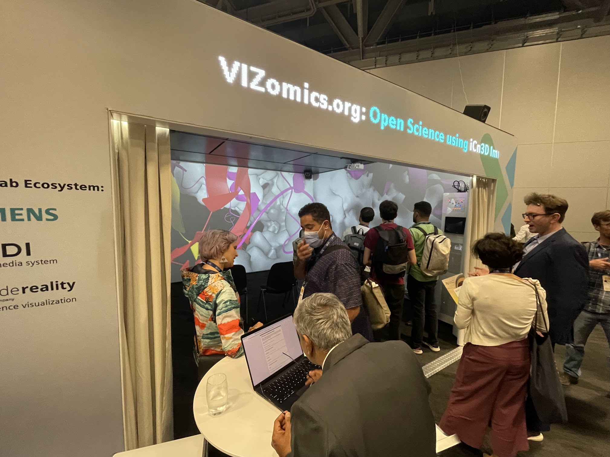
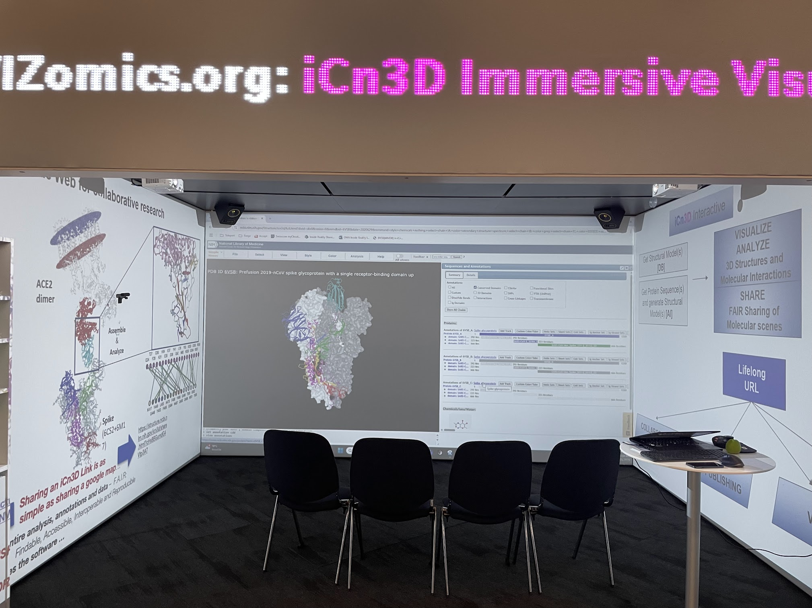

# POSE Phase I Documentation

## Project  
- POSE: Phase I: Pathway to iCn3D-based Open-Source Ecosystem for Collaborative Research and Education in Mechanistic Biology  
- PI: Ravinder Abrol | Co-lead: Philippe Youkharibache | Key contributor: Chris Henn

## Purpose
- Archival of POSE Phase 1 materials (proposal, engineering tasks performed during project, experiment summaries, use case studies, code snippets).

## Tasks
- Link to [task inventory](engineering-tasks.md)

Last updated: 2026-06-14
